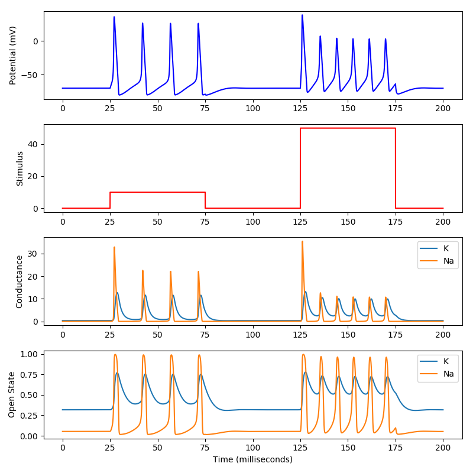

# pyHH
**pyHH is a simple Python implementation of the Hodgkin-Huxley spiking neuron model.** While many implementations of this model exist online, pyHH strives to be the simplest to understand (and port to other languages). pyHH simulates conductances and calculates membrane voltage at discrete time points and does not require a differential equation solver.

## Code Examples

This project is early in development. However, developers interested in viewing existing code can find somewhat functional code examples in [dev/](/dev/)

## Theory

### Hodgkin–Huxley model
The Hodgkin–Huxley model, or conductance-based model, is a mathematical model that describes how action potentials in neurons are initiated and propagated. 

Hodgkin–Huxley type models represent the biophysical characteristic of cell membranes. The lipid bilayer is represented as a capacitance (`Cm`). Voltage-gated and leak ion channels are represented by nonlinear (`gn`) and linear (`gL`) conductances, respectively. 

The electrochemical gradients driving the flow of ions are represented by batteries (`E`), and ion pumps and exchangers are represented by current sources (`Ip`).

### Additional Resources
* [Hodgkin and Huxley, 1952](https://www.ncbi.nlm.nih.gov/pmc/articles/PMC1392413/pdf/jphysiol01442-0106.pdf) (the original manuscript)
* [The Hodgkin-Huxley Mode](http://www.genesis-sim.org/GENESIS/iBoG/iBoGpdf/chapt4.pdf) (The GENESIS Simulator, Chapter 4)
* Wikipedia: [Hodgkin–Huxley model](https://en.wikipedia.org/wiki/Hodgkin%E2%80%93Huxley_model)
* [Hodgkin-Huxley spiking neuron model in Python](https://www.bonaccorso.eu/2017/08/19/hodgkin-huxley-spiking-neuron-model-python/) by Giuseppe Bonaccorso - a HH model which uses the [`scipy.integrate.odeint` ordinary differential equation solver](https://docs.scipy.org/doc/scipy/reference/generated/scipy.integrate.odeint.html)
* [Introduction to Computational Modeling: Hodgkin-Huxley Model](http://andysbrainblog.blogspot.com/2013/10/introduction-to-computational-modeling.html) by Andrew Jahn - a commentary of the HH model with matlab code which discretely simulates conductances
* [NeuroML Hodgkin Huxley Tutorials](https://github.com/swharden/hodgkin_huxley_tutorial)
