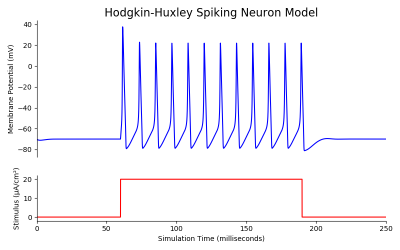
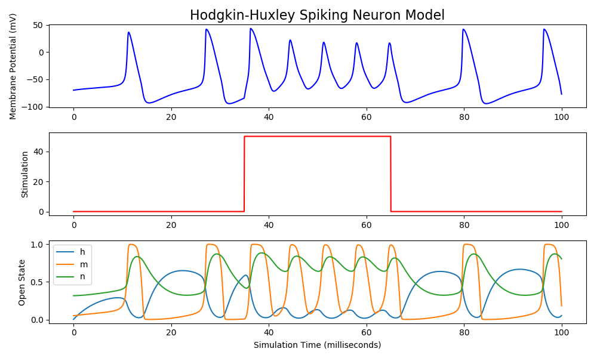

# pyHH
**pyHH is a simple Python implementation of the Hodgkin-Huxley spiking neuron model.** pyHH simulates conductances and calculates membrane voltage at discrete time points so it does not require a differential equation solver. [HHSharp](https://github.com/swharden/HHSharp) is a similar project written in C#.



## Minimal Code Example
A full Hodgkin-Huxley spiking neuron model and simulation was created in fewer than 100 lines of Python ([dev/concept4.py](dev/concept4.py)). Unlike other code examples on the internet, this implementation is object-oriented and Pythonic. When run, it produces the image above.

## Python Package
The `pyhh` package includes Hodgkin-Huxley models and additional tools to organize simulation data. 

### Simulation Steps

1. Create a model cell and customize its properties if desired
2. Create a stimulus waveform (a numpy array)
3. Create a simulation by giving it model the waveform you created
4. Plot various properties of the stimulation

### Example Usage

```python
# customize a neuron model if desired
model = pyhh.HHModel()
model.gNa = 100  # typically 120
model.gK = 5  # typically 36
model.EK = -35  # typically -12

# customize a stimulus waveform
stim = np.zeros(20000)
stim[7000:13000] = 50  # add a square pulse

# simulate the model cell using the custom waveform
sim = pyhh.Simulation(model)
sim.Run(stimulusWaveform=stim, stepSizeMs=0.01)
```

```python
# plot the results with MatPlotLib
plt.figure(figsize=(10, 8))

ax1 = plt.subplot(411)
ax1.plot(sim.times, sim.Vm - 70, color='b')
ax1.set_ylabel("Potential (mV)")
ax1.set_title("Hodgkin-Huxley Spiking Neuron Model", fontSize=16)

ax2 = plt.subplot(412)
ax2.plot(sim.times, stim, color='r')
ax2.set_ylabel("Stimulation (µA/cm²)")

ax3 = plt.subplot(413, sharex=ax1)
ax3.plot(sim.times, sim.StateH, label='h')
ax3.plot(sim.times, sim.StateM, label='m')
ax3.plot(sim.times, sim.StateN, label='n')
ax3.set_ylabel("Activation (frac)")
ax3.legend()

ax4 = plt.subplot(414, sharex=ax1)
ax4.plot(sim.times, sim.INa, label='VGSC')
ax4.plot(sim.times, sim.IK, label='VGKC')
ax4.plot(sim.times, sim.IKleak, label='KLeak')
ax4.set_ylabel("Current (µA/cm²)")
ax4.set_xlabel("Simulation Time (milliseconds)")
ax4.legend()

plt.tight_layout()
plt.savefig("tests/demo.png")
plt.show()
```



## Theory

Visit https://github.com/swharden/HHSharp for code concepts and simulation notes. Although the language is different, the biology and implementation is the same.


### Additional Resources
* [Hodgkin and Huxley, 1952](https://www.ncbi.nlm.nih.gov/pmc/articles/PMC1392413/pdf/jphysiol01442-0106.pdf) (the original manuscript)
* [The Hodgkin-Huxley Mode](http://www.genesis-sim.org/GENESIS/iBoG/iBoGpdf/chapt4.pdf) (The GENESIS Simulator, Chapter 4)
* Wikipedia: [Hodgkin–Huxley model](https://en.wikipedia.org/wiki/Hodgkin%E2%80%93Huxley_model)
* [Hodgkin-Huxley spiking neuron model in Python](https://www.bonaccorso.eu/2017/08/19/hodgkin-huxley-spiking-neuron-model-python/) by Giuseppe Bonaccorso - a HH model which uses the [`scipy.integrate.odeint` ordinary differential equation solver](https://docs.scipy.org/doc/scipy/reference/generated/scipy.integrate.odeint.html)
* [Introduction to Computational Modeling: Hodgkin-Huxley Model](http://andysbrainblog.blogspot.com/2013/10/introduction-to-computational-modeling.html) by Andrew Jahn - a commentary of the HH model with matlab code which discretely simulates conductances
* [NeuroML Hodgkin Huxley Tutorials](https://github.com/swharden/hodgkin_huxley_tutorial)
* [Summary of the Hodgkin-Huxley model](http://ecee.colorado.edu/~ecen4831/HHsumWWW/HHsum.html) by Dave Beeman
